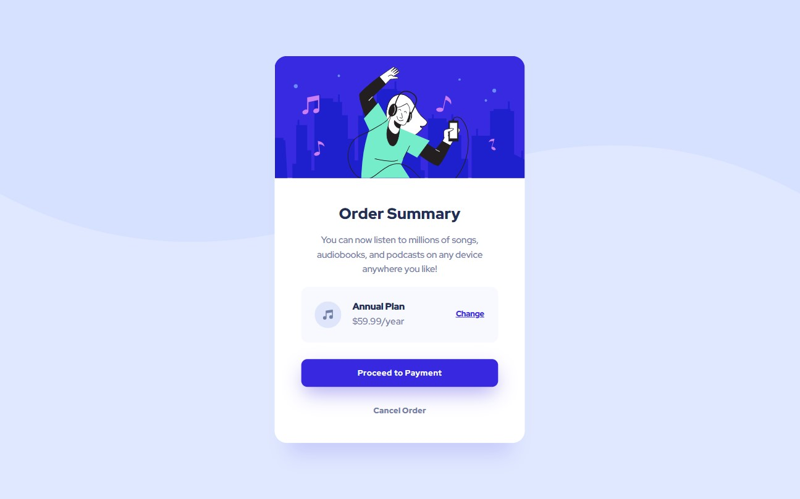

# Frontend Mentor - Order summary card solution

This is a solution to the [Order summary card challenge on Frontend Mentor](https://www.frontendmentor.io/challenges/order-summary-component-QlPmajDUj). Frontend Mentor challenges help you improve your coding skills by building realistic projects. 

## Table of contents

- [Overview](#overview)
  - [The challenge](#the-challenge)
  - [Screenshot](#screenshot)
  - [Links](#links)
- [My process](#my-process)
  - [Built with](#built-with)
  - [What I learned](#what-i-learned)
  - [Continued development](#continued-development)
  - [Useful resources](#useful-resources)
- [Author](#author)


## Overview

### The challenge

Users should be able to:

- See hover states for interactive elements

### Screenshot



- 1440px


- 375px

### Links

- Solution URL: [Solution](https)
- Live Site URL: [Live site](https)


## My process

### Built with

- Semantic HTML5 markup
- CSS custom properties
- Flexbox

### What I learned

```css
main {
  background: url(./images/pattern-background-mobile.svg);
  background-repeat: no-repeat;
  background-size: contain;
}
```

### Continued development

Realized I've been focusing on only building projects with flexbox, so for the next project I'll try using grid layout.

### Useful resources

- [Full Size Background](https://stackoverflow.com/questions/14059429/css-full-size-background-image) - This helped me to adjust the background image.


## Author

- Frontend Mentor - [@Somebodyidk](https://www.frontendmentor.io/profile/Somebodyidk)